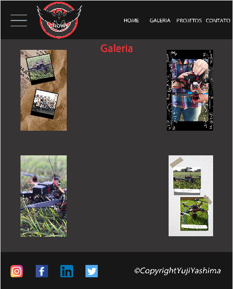

<h1 align="center">
  
    <br>
  <h1 align="center">Prototype Crows</h1>
</h1>

<h4 align="center">
  Prototype of website created in the CPA class, along with integration of the school's Drone project.
</h4>

<p align="center">
  <a href="#Built with">Built with</a>&nbsp;&nbsp;&nbsp;|&nbsp;&nbsp;&nbsp;
  <a href="#how-to-run">How to run</a>&nbsp;&nbsp;&nbsp;|&nbsp;&nbsp;&nbsp;
  <a href="#Screen">ScreenShots</a>&nbsp;&nbsp;&nbsp;|&nbsp;&nbsp;&nbsp;
  <a href="#Other">Others</a>&nbsp;&nbsp;&nbsp;
</p>
<br><br>

<h2 id="Built with">:pencil2: Built with</h2>

This project was built with prototype technologie and some strategies:

- Adobe FireWorks
- Photoshop
- Corel Draw
- Image gallery
- Buttons
- Pop up
- Menu Rollover

<h2 id="how-to-run">:computer: How to run</h2>

```bash
# to clone the repository
git clone https://github.com/YujiYashima/Prototype_Crows.git
```
Or download the folder and open this project in FireWorks

<h2 id="Screen">:camera: ScreenShots</h2>

<h3 align="center">
  &nbsp;&nbsp;&nbsp;&nbsp;&nbsp;&nbsp;<br><br>
  &nbsp;&nbsp;&nbsp;&nbsp;&nbsp;&nbsp;<br><br>
  &nbsp;&nbsp;&nbsp;&nbsp;&nbsp;&nbsp;<br><br>
  
</h3>

<h2 id="Other">:paperclip: Others</h2>

- <a href="https://github.com/YujiYashima/Prototype_Crows/blob/master/LICENSE">Licence</a>
- <a href="https://etecfernandopolis.com.br/site/inicio/">Site Etec Fernandópolis</a>
- <a href="https://yujiyashima.github.io/Prototype_Crows/Site_html/Home.htm">Protótipo</a>

